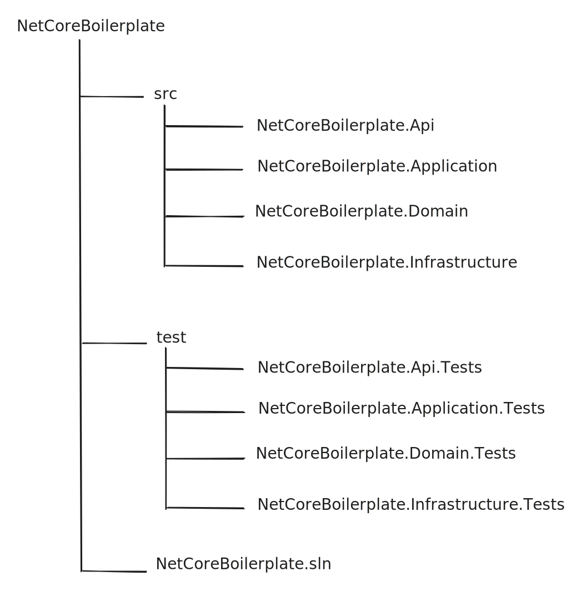

# README.md

<pre><code><strong>---------------------------------------src----------------------------------------
</strong><strong>NetCoreBoilerplate.Api                  -> Presentation Layer (API)
</strong>NetCoreBoilerplate.Application          -> Application Layer
NetCoreBoilerplate.Domain               -> Domain Layer
NetCoreBoilerplate.Infrastructure       -> Infrastructure Layer
--------------------------------------tests-----------------------------------------
NetCoreBoilerplate.Api.Tests            -> Unit Tests for API
NetCoreBoilerplate.Application.Tests    -> Unit Tests for Application Layer
NetCoreBoilerplate.Domain.Tests         -> Unit Tests for Domain Layer
NetCoreBoilerplate.Infrastructure.Tests -> Unit Tests for Infrastructure Layer
------------------------------------sources-----------------------------------------
NetCoreBoilerplate.sln                  -> Solution file
</code></pre>

